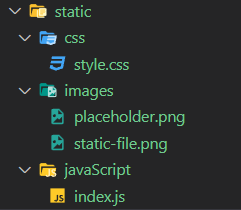

# flask_checklist

## Initial Setup

- [x] create directory
- [ ] create the virtual environment:

```
pipenv install flask
```
- [ ] activate the virtual environment:

```
pipenv shell
```

- [ ] create [server.py](server.py):

```py
from flask import Flask, render_template
app = Flask(__name__)  

@app.route('/hello')        
def hello_world():
    return 'Hello World!'

@app.route('/')
def index():
    return render_template('index.html')

if __name__=="__main__":    
    app.run(debug=True)
```

**[server.py](server.py) is subject to SEVERAL modifications!!!** 

## Templates

- [ ] create a [templates/index.html](templates/index.html)

```html
<!DOCTYPE html>
<html lang="en">
<head>
    <meta charset="UTF-8">
    <meta http-equiv="X-UA-Compatible" content="IE=edge">
    <meta name="viewport" content="width=device-width, initial-scale=1.0">
    <link href="https://cdn.jsdelivr.net/npm/bootstrap@5.1.3/dist/css/bootstrap.min.css" rel="stylesheet" integrity="sha384-1BmE4kWBq78iYhFldvKuhfTAU6auU8tT94WrHftjDbrCEXSU1oBoqyl2QvZ6jIW3" crossorigin="anonymous">
    <link rel="stylesheet" type="text/css" href="{{ url_for('static', filename='style.css') }}">
    <script type="text/javascript" src="{{ url_for('static', filename='index.js') }}"></script>
    <title>index</title>
</head>
<body>
    
    <h1>Index</h1>

</body>
</html>
```

- [ ] import the `render_template` method. Modify the first line of [server.py](server.py) as follows:
```py
from flask import Flask, render_template
```
## Static files

- [ ] add [static](static) directory. File structure should look like this:




